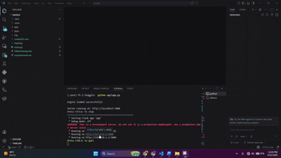

# RuralMED AI — Offline Clinical Decision Support

> Gemma 4 E4B powered clinical AI for rural health workers. Runs 100% offline. No internet. No cloud. No cost.

**Tracks:** Health & Sciences Impact · Ollama Special Technology · Main Track  
**Challenge:** Gemma 4 Impact Challenge 2026 — Kaggle

---

## The Problem

Over 1 billion people live beyond quality healthcare. Rural health workers make life-or-death decisions every day — diagnosing malaria, pneumonia, severe dehydration — with no specialist access, no reliable internet, and no clinical decision support tools. RuralMED AI changes that.

---

## What It Does

A health worker enters patient symptoms and vitals. RuralMED returns in 60–90 seconds:

- **Triage priority** (RED = refer urgently / YELLOW = monitor / GREEN = treat at clinic)
- **Top 3 differential diagnoses**
- **Treatment protocol** with specific medication doses
- **Referral decision** with clear reasoning
- **Follow-up timeline**

**Everything runs locally. No internet. No data leaves the device.**

---

## Demo



Turn off Wi-Fi. Open `http://localhost:5000`. It still works. That is the point.

---

## Architecture

```
Health Worker
     │
     ▼
Flask Web UI (localhost:5000)
     │
     ▼
RAG Engine (ChromaDB + all-MiniLM-L6-v2)
     │  retrieves WHO/MSF guidelines
     ▼
Ollama (local inference — no internet)
     │
     ▼
Gemma 4 E4B (fine-tuned on MedQA with Unsloth)
     │
     ▼
Structured Clinical Response
```

---

## Quick Start

### Prerequisites
- Python 3.10+
- [Ollama](https://ollama.com) installed
- 10GB disk space
- No GPU required for inference

### 1. Install Ollama and pull model
```bash
# Download Ollama from https://ollama.com
ollama pull gemma4:e4b
ollama serve
```

### 2. Clone and install
```bash
git clone https://github.com/YOURNAME/ruralmED.git
cd ruralmED
python -m venv ruralmED-env

# Windows:
ruralmED-env\Scripts\activate
# Mac/Linux:
source ruralmED-env/bin/activate

pip install -r requirements.txt
```

### 3. Build knowledge base
```bash
python rag/build_knowledge_base.py
```

### 4. Start the app
```bash
# Terminal 1 — keep running:
ollama serve

# Terminal 2:
python app/app.py
```

Open browser: **http://localhost:5000**

**Turn off your Wi-Fi. Test it. It works.**

---

## Fine-Tuning (Optional — improves clinical accuracy)

The base Gemma 4 E4B model works well. For the fine-tuned RuralMED model use a free GPU on Kaggle Notebooks:

```bash
# Prepare data
python data/download_datasets.py
python training/prepare_data.py

# Fine-tune (run on Kaggle/Colab for free GPU)
python training/finetune.py

# Load fine-tuned model into Ollama
ollama create ruralmED -f training/Modelfile
```

---

## RAG Knowledge Base

Built from WHO IMAI Primary Care Guidelines and MSF Essential Medicine protocols:

| Guideline | Coverage |
|---|---|
| WHO Fever Assessment | Danger signs, RDT protocol |
| WHO Malaria Treatment | Artemether-Lumefantrine doses |
| WHO Pneumonia (Children) | Respiratory rate thresholds, amoxicillin |
| WHO Diarrhea Management | Dehydration classification, ORS |
| WHO Malnutrition | MUAC assessment, RUTF protocol |
| WHO Antenatal Care | Red flags, pre-eclampsia |
| ETAT Triage System | RED/YELLOW/GREEN classification |
| WHO Newborn Danger Signs | Immediate referral criteria |

---

## Project Structure

```
ruralmED/
├── data/
│   ├── download_datasets.py    # Download MedQA training data
│   └── prepare_data.py         # Format for Gemma 4 instruction tuning
├── training/
│   ├── finetune.py             # Unsloth LoRA fine-tuning
│   ├── evaluate.py             # Benchmark base vs fine-tuned
│   └── Modelfile               # Ollama model configuration
├── rag/
│   ├── build_knowledge_base.py # Load WHO guidelines into ChromaDB
│   └── inference.py            # RAG + Ollama inference engine
├── app/
│   ├── app.py                  # Flask backend
│   └── templates/
│       └── index.html          # Web UI (EN/UR/AR)
├── requirements.txt
└── README.md
```

---

## Technical Stack

| Component | Technology | Why |
|---|---|---|
| LLM | Gemma 4 E4B | Edge-optimized, runs on CPU |
| Fine-tuning | Unsloth + LoRA | 2x faster, 60% less VRAM |
| Inference | Ollama | Local serving, zero internet |
| Vector DB | ChromaDB | Offline, persistent, fast |
| Embeddings | all-MiniLM-L6-v2 | 22MB, CPU-friendly |
| Backend | Flask | Lightweight, easy to deploy |
| Frontend | HTML/CSS/JS | No framework, works anywhere |

---

## Impact

Pakistan has **5,765 Basic Health Units** serving rural populations of 10,000–15,000 each.

If 10% deployed RuralMED AI:
- ~7 million annual consultations supported by evidence-based AI
- Zero recurring cost after $200 laptop investment
- Malaria, pneumonia, and dehydration — top 3 causes of child mortality — specifically addressed

**Target deployment regions:** Rural Punjab (Pakistan) · Northern Nigeria · Rural Kenya · Eastern DRC

---

## License

Apache 2.0 — free to use, modify, and deploy in any clinical or research setting.

---

## Citation

```bibtex
@misc{ruralmED2026,
  title  = {RuralMED AI: Offline Clinical Decision Support for Rural Health Workers},
  author = {YOUR NAME},
  year   = {2026},
  url    = {https://github.com/YOURNAME/ruralmED}
}
```
